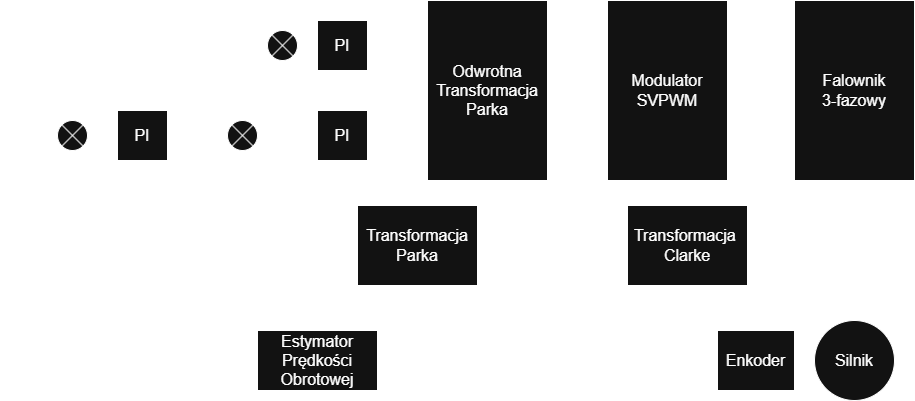
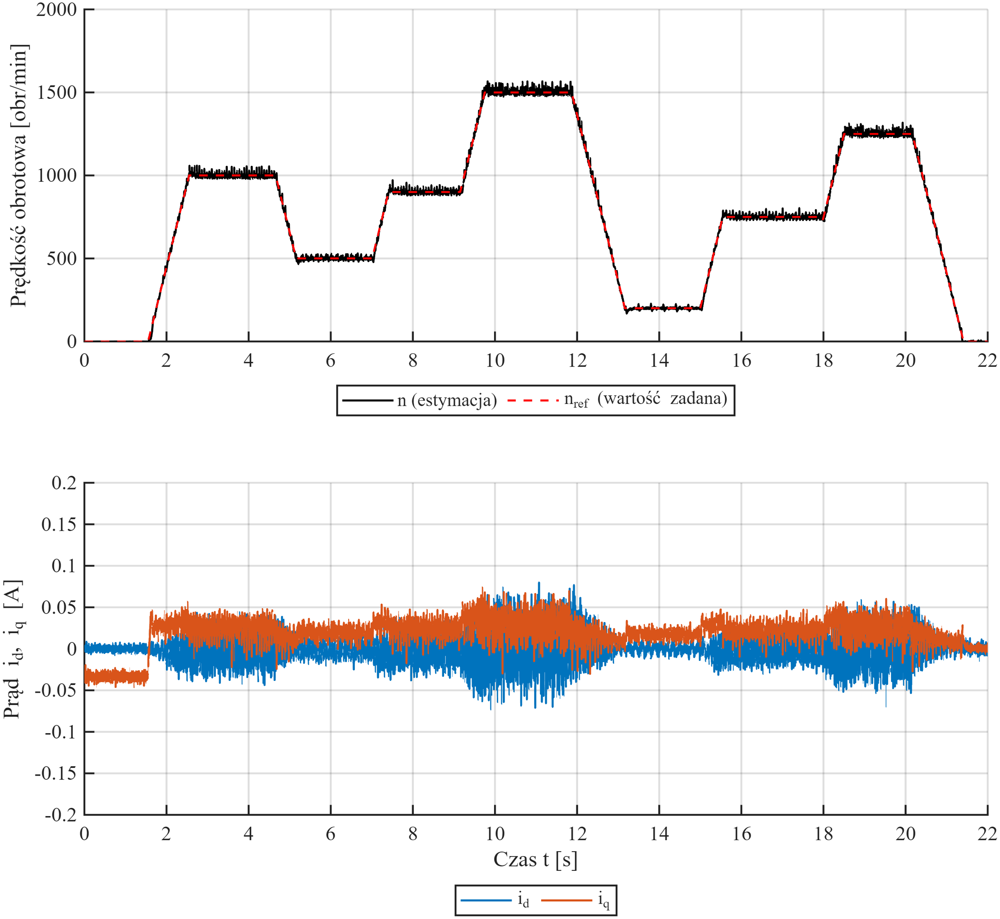
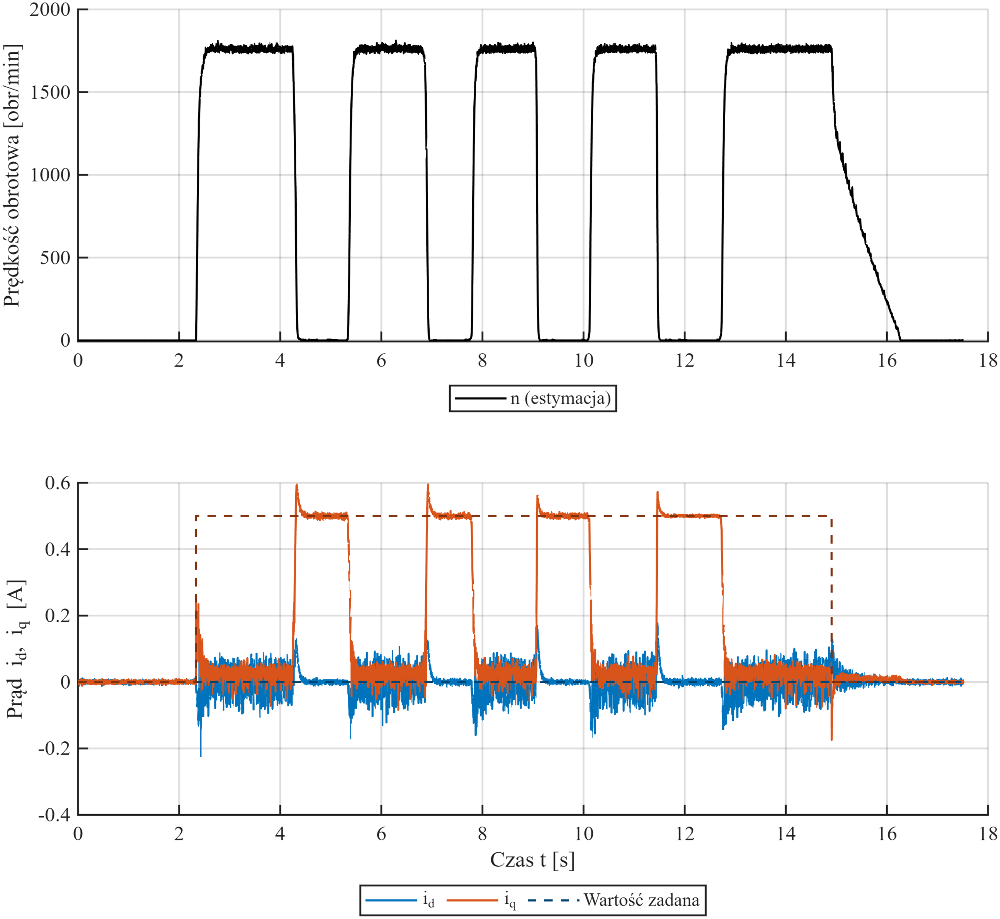

# ⚡ STM32 PMSM Field-Oriented Control (FOC)

Implementation of a high-performance **Field-Oriented Control (FOC)** algorithm  
for a **Permanent Magnet Synchronous Motor (PMSM)** using the STM32G474RE microcontroller.

This project demonstrates a complete real-time embedded motor control system including current sensing, coordinate transformations, PI control loops, and Space Vector PWM modulation.

---

## 📌 Project Overview

The objective of this project was to design, implement, and experimentally validate a deterministic real-time motor control system capable of:

- ✅ Precise electromagnetic torque control  
- ✅ Stable and dynamic speed regulation  
- ✅ Reduced torque ripple  
- ✅ Deterministic execution at 10 kHz  

The firmware was developed entirely in **C** using **STM32CubeIDE**.

---

## 🧠 Control Architecture

The system uses a cascaded control structure:

- **Inner current loop** – 10 kHz  
- **Outer speed loop** – 1 kHz  
- **PWM modulation frequency** – 20 kHz  

### Control Flow

1. Phase current measurement (ADC, injected mode)
2. Clarke transformation (abc → αβ)
3. Park transformation (αβ → dq)
4. PI current controllers (id, iq)
5. Inverse Park transformation
6. Space Vector PWM generation
7. Timer CCR update (TIM1, center-aligned mode)

---

## 📷 System Block Diagram

---

## 🧩 Hardware Platform

| Component | Description |
|------------|------------|
| MCU | STM32G474RE (170 MHz, Cortex-M4 + FPU) |
| Power Stage | X-NUCLEO-IHM16M1 |
| Gate Driver | STSPIN830 |
| Motor | iFlight GM2804 (PMSM, 7 pole pairs) |
| Encoder | AS5048A (14-bit magnetic absolute encoder) |

### Key Features

- Three-shunt current sensing (low-side)
- SPI + DMA encoder communication
- ADC synchronized to PWM center
- Center-aligned PWM (TIM1)
- Deterministic interrupt-based execution

---

## 🔁 Space Vector PWM (SVPWM)

The implementation includes:

- Sector detection
- Active vector time computation
- Symmetrical zero vector distribution
- Linear modulation range limitation
- Direct update of TIM1 CCR registers

Voltage vector magnitude limiting ensures operation within safe DC bus boundaries.

---

## 📊 Experimental Results

The system was validated through:

- ✅ Phase current waveform verification  
- ✅ Torque (Iq) step response tests  
- ✅ Speed step response tests  
- ✅ Load disturbance response  

### Speed Control Step Response

### Torque (Iq) Step Response

---

Motor state machine:

- IDLE
- ALIGNMENT
- TORQUE_CONTROL
- SPEED_CONTROL
- FAULT

---

## 🛠 Technical Challenges Solved

- Synchronizing ADC sampling with PWM center
- Reducing switching noise in current measurements
- Managing SPI latency using DMA
- Preventing integral windup
- Filtering discrete speed estimation
- Ensuring constant-time FOC execution

---

## 📌 Skills Demonstrated

- Embedded C (bare-metal)
- Real-time interrupt design
- Motor control theory (PMSM, dq model)
- Signal processing (filtering, discrete differentiation)
- Hardware debugging with oscilloscope
- STM32 timers, ADC, DMA, SPI
- Deterministic firmware architecture

---

---

## 🔭 Further Development & Ongoing Work

The project is being actively extended with advanced control and estimation features:

### 🧮 Kalman Filter for Speed Estimation *(in progress)*

Currently implementing a discrete-state Kalman filter to improve rotor speed estimation.

Goals:
- Reduce noise amplification caused by discrete differentiation
- Improve low-speed stability
- Increase robustness against encoder quantization effects
- Provide smoother feedback for the outer speed loop

The filter will replace the current low-pass filtered Euler-based estimator.

---

### 🎯 Position Control Loop *(in progress)*

Development of a cascaded position control structure:

Position Loop → Speed Loop → Current Loop

Planned features:
- Discrete PID position controller
- Trajectory ramp generation
- Motion profile support (trapezoidal profile)
- Anti-windup and saturation handling

This extension transforms the system into a full servo-drive platform.

---

### ⚙ CORDIC Hardware Acceleration

Planned optimization using the STM32G4 hardware **CORDIC accelerator** to:

- Replace software `atan2f()` in SVPWM
- Compute sine/cosine in constant time
- Reduce FOC execution latency
- Enable running FOC at full 20 kHz PWM rate

---

### 🧵 FreeRTOS Integration

Migration toward an RTOS-based architecture to:

- Separate control tasks from communication tasks
- Improve modularity and scalability
- Introduce task prioritization
- Enable future multi-axis support

The real-time FOC loop will remain interrupt-driven to preserve determinism.

---

### 🔌 CAN Communication (Multi-Node Applications)

Implementation of CAN interface for:

- Multi-node motor networks
- Distributed robotics applications
- Integration with higher-level controllers
- Real-time telemetry streaming

Planned support for:
- CANopen-style command structure
- Remote parameter tuning

---

### 🌀 Sensorless Mode (Back-EMF Observer)

Development of a sensorless control mode using Back-EMF observer:

- Rotor position estimation without encoder
- Reduced hardware cost
- Improved robustness in industrial environments
- Startup sequence for low-speed operation

---

## 🎯 Purpose

This project was developed as an engineering thesis and serves as a practical reference for high-performance embedded motor control systems.

---
